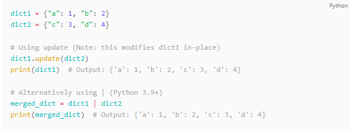

### Indexing and Accessing

##### Lists(Mutable)

```python
# Indexing
my_list = [1, 2, 3, 4, 5]
print(my_list[0])  # ▶ 1

# Slicing
print(my_list[1:4])  # ▶ [2, 3, 4]

# NO get function for lists 
my_list.get(1)  # AttributeError: 'list' object has no attribute 'get'

```

--
##### Strings(Immutable)

```python
# Indexing
my_str = 'hello'
print(my_str[0])  # ▶ 'h'

# Slicing
print(my_str[1:4])  # ▶ 'ell'

# No get function
my_string.get(1)  # AttributeError: 'str' object has no attribute 'get'

```
--
#### Sets(Unordered)

#### How can you access elements in sets then? 
```python
# my_set[0]
# if you uncomment above line, you will get an error
# TypeError: 'set' object does not support indexing

# You can do a memebership test 
my_set = {1, 2, 3, 4, 5}
print(3 in my_set)  # Output: True
print(6 in my_set)  # Output: False

# you can iterate through it 
my_set = {1, 2, 3, 4, 5}
for element in my_set:
    print(element)
# Output:
# 1
# 2
# 3
# 4
# 5

```

--

you can convert to a list and index? 
```python
my_set = {1, 2, 3, 4, 5}
my_list = list(my_set)
print(my_list[0])  # Output: 1 (the order is not guaranteed)
```

--
#### Tuples(Immutable)

```python
# Indexing
my_tuple = (1, 2, 3, 4, 5)
print(my_tuple[0])  # ▶ 1

# Slicing
print(my_tuple[1:4])  # ▶ (2, 3, 4)

# No get function
my_tuple.get(1)  # AttributeError: 'tuple' object has no attribute 'get'


```

--
#### Dictionaries

```python
# Example 1: Changing and adding Dictionary Elements

my_dict = {'name':'Arthur', 'age':24}

my_dict['age'] = 25   # update value
print(my_dict)        # ▶ {'age': 25, 'name': 'Arthur'}

my_dict['address'] = 'Downtown'  # add item
print(my_dict)        # ▶ {'name': 'Arthur', 'age': 25, 'address': 'Downtown'}

my_dict = {'a': 1, 'b': 2, 'c': 3}
print(my_dict.get('b'))  # Output: 2
print(my_dict.get('d', 0))  # Output: 0 (default value)

```

---
### Adding an element

##### Lists(Mutable)

```python
# Example: Appending and Extending lists in Python

odd = [1, 3, 5]

odd.append(7)
print(odd)  # ▶ [1, 3, 5, 7]

odd.extend([9, 11, 13])
print(odd)  # ▶ [1, 3, 5, 7, 9, 11, 13]

odd = [1, 9]
odd.insert(1,3)
print(odd)  # ▶ [1, 3, 9]

```

--
##### Strings(Immutable)

- you can't ! you have to change it 
- you can do that with slicing or with + operator

```python
original_string = "Hello, "
words = ["World!", "How", "are", "you?"]
new_string = original_string + " ".join(words)  # Creates a new string "Hello, World! How are you?"
print(new_string)  # Output: Hello

original_string = "Hello, "
new_string = original_string + "World!"  # Creates a new string "Hello, World!"
print(new_string)  # Output: Hello, World!

original_string = "Hello, World!"
insert_string = " Beautiful"
split_point = 7  # Position to insert the new string
new_string = original_string[:split_point] + insert_string + original_string[split_point:]  # Creates a new string "Hello, Beautiful World!"
print(new_string)  # Output: Hello, Beautiful World!


```

--
#### Sets(Unordered)


```python
# my_set[0]
# if you uncomment above line, you will get an error
# TypeError: 'set' object does not support indexing

# add an element
my_set = {1, 3}
my_set.add(2)
print(my_set)     # ▶ {1, 2, 3}

# add multiple elements
my_set.update([2, 3, 4])
print(my_set)     # ▶ {1, 2, 3, 4}

# add list and set
my_set.update([1,7],(8,9,10),{1,5,9,10})
print(my_set)     # ▶ {1, 2, 3, 4, 5, 7, 8, 9, 10}

# Three iterables are passed as arguments to `update()`: a list `[1,7]`, a tuple `(8,9,10)`, and a set `{1,5,9,10}`.
# The `update()` method will go through each iterable, one by one, and add each element from these iterables to `my_set`.

```

--

#### Tuples(Immutable)

```python
original_tuple = (1, 2, 3)
additional_value = (4,)  # Note the comma; it's necessary to create a single-element tuple
new_tuple = original_tuple + additional_value
print(new_tuple)  # Output: (1, 2, 3, 4)
```

--

#### Dictionaries

```python
my_dict = {"key1": "value1", "key2": "value2"}
my_dict["key3"] = "value3"  # Adds a new key-value pair to the dictionary
print(my_dict)  # Output: {'key1': 'value1', 'key2': 'value2', 'key3': 'value3'}


my_dict = {"key1": "value1", "key2": "value2"}
my_dict.update({"key3": "value3"})  # Adds a new key-value pair to the dictionary
print(my_dict)  # Output: {'key1': 'value1', 'key2': 'value2', 'key3': 'value3'}

```

---
### Replacing an element 
##### Lists(Mutable)

```python
  
odd = [2, 4, 6, 8]

odd[0] = 1            # ▶ [1, 4, 6, 8] ∵ update 1st element
print(odd)

odd[1:4] = [3, 5, 7]  # ▶ [1, 3, 5, 7] ∵ update 2nd to 4th elements
print(odd)
```

--
##### Strings(Immutable)

```python
my_string = 'python'
my_string[5] = 'a' ## ERROR
## we can't CHANGE, but we can RECREATE

```python
s = 'Happy New Year'
print(s.replace('Happy','Brilliant')) ## it creates a new string
print(s) ## it doesn't change 
print("Brilliant" + s[5:])
```
```
Brilliant New Year
Happy New Year
Brilliant New Year
```

--
#### Sets(Unordered)


###### Fix this
```python
# add list and set
my_set.update([1,7],(8,9,10),{1,5,9,10})
print(my_set)     # ▶ {1, 2, 3, 4, 5, 7, 8, 9, 10}
```

--

#### Tuples(Immutable)

```python
# Changing tuple values
my_tuple = (4, 2, 3, [6, 5])

# my_tuple[1] = 9     # ▶ TypeError: 'tuple' object does not support item assignment

# However, item of mutable element can be changed
my_tuple[3][0] = 9
print(my_tuple)  # ▶ (4, 2, 3, [9, 5]
```

--

#### Dictionaries

```python
# Assume we have the following dictionary:
my_dict = {'a': 1, 'b': 2, 'c': 3}

# To update the value associated with the key 'b' to 5: 
# if it didn't exist, it would add it to the dict instead. see above!
my_dict['b'] = 5
print(my_dict)  # Output: {'a': 1, 'b': 5, 'c': 3}

# Assume we have the following dictionary:
my_dict = {'a': 1, 'b': 2, 'c': 3}

# To update the value associated with the key 'b' to 5:
my_dict.update({'b': 5})
print(my_dict)  # Output: {'a': 1, 'b': 5, 'c': 3}

# To add a new key-value pair:
my_dict.update({'d': 4})
print(my_dict)  # Output: {'a': 1, 'b': 5, 'c': 3, 'd': 4}

# You can update or add multiple key-value pairs at once:
my_dict.update({'e': 5, 'f': 6, 'a': 0})
print(my_dict)  # Output: {'a': 0, 'b': 5, 'c': 3, 'd': 4, 'e': 5, 'f': 6}


```

---

### Removing an element
##### Lists(Mutable)

```python
my_list = ['p', 'r', 'o', 'b', 'l', 'e', 'm']

del my_list[2]  # delete one item
print(my_list)  # ▶ ['p', 'r', 'b', 'l', 'e', 'm']

del my_list[1:5]  # delete multiple items
print(my_list)  # ▶ ['p', 'm']

del my_list      # delete entire list
print(my_list)   # ▶ NameError: name 'my_list' is not defined

```

--

```python
my_list = ['p', 'r', 'o', 'b', 'l', 'e', 'm']
my_list.remove('p')

print(my_list)        # ▶ ['r', 'o', 'b', 'l', 'e', 'm']
print(my_list.pop(1)) # ▶ 'o'
print(my_list)        # ▶ ['r', 'b', 'l', 'e', 'm']
print(my_list.pop())  # ▶ 'm'
print(my_list)        # ▶ ['r', 'b', 'l', 'e']

my_list.clear()
print(my_list)        # ▶ []

# Example:

my_list = ['p','r','o','b','l','e','m']

my_list[2:3] = []
print(my_list)  # ▶ ['p', 'r', 'b', 'l', 'e', 'm']

my_list[2:-2] = []
print(my_list)  # ▶ ['p', 'r', 'e', 'm']

```

--
##### Strings(Immutable)

```python
my_string = 'python'
del my_string[1]  # deleting element of string generates error!
```

```python
my_string = 'python'
del my_string # deleting whole string using 'del' keyword can delete it.
my_string # ERROR because there is nothing in my_string now 
# it's uninitialized
```

--
#### Sets(Unordered)


```python
# Example: Difference between discard() and remove()

# initialize my_set
my_set = {1, 3, 4, 5, 6}
print(my_set)     # ▶ {1, 3, 4, 5, 6}

# discard an element
my_set.discard(4)
print(my_set)     # ▶ {1, 3, 5, 6}

# remove an element
my_set.remove(6)
print(my_set)     # ▶ {1, 3, 5}

# discard an element not present in my_set
my_set.discard(2)
print(my_set)     # ▶ {1, 3, 5} NO ERROR!

# remove an element not present in my_set you will get an error.
my_set.remove(2)  # ▶ KeyError!!!

```

--

```python
# Example:

# initialize my_set
my_set = set("HelloWorld")
print(my_set)        # ▶ unorderd set of unique elements

# pop an element
print(my_set.pop())  # ▶ removes a random element

# pop another element
my_set.pop()
print(my_set)

# clear my_set
my_set.clear()
print(my_set)        # ▶ set()

```

--

##### Tuples(Immutable)

```python
# Deletion
# can't delete items
del my_tuple[3]  # ▶ TypeError: 'tuple' object doesn't support item deletion
```

--

##### Dictionaries

```python
# Example: Removing elements from a dictionary

squares = {1:1, 2:4, 3:9, 4:16, 5:25}   # create a dictionary

# remove a particular item, returns its value
print(squares.pop(4))    # ▶ 16
print(squares)           # ▶ {1: 1, 2: 4, 3: 9, 5: 25}

# remove an arbitrary item, return (key,value)
print(squares.popitem()) # ▶ (5, 25)
print(squares)           # ▶ {1: 1, 2: 4, 3: 9}

squares.clear()          # remove all items
print(squares)           # ▶ {}

del squares              # delete the dictionary itself
print(squares)           # ▶ NameError!!!

```

---
### Sorting the collection
##### Lists(Mutable)

```python
l = [5,3,4,1,2]
print(sorted(l)) # 1,2,3,4,5
print(sorted(l, reverse=True)) # 5,4,3,2,1
print(set(l)) # 1.2.3.4.5
```

--
##### Strings(Immutable)

```python
s = "cab"
print(sorted(s))  # Output: ['a', 'b', 'c']
```


--

#### Tuples(Immutable)

###### Can you sort a tuple? 
```python
t = (5,3,4,1,2)
print(sorted(t))  # Output: [1, 2, 3, 4, 5]
print(tuple(sorted(t)))  # Output: (1, 2, 3, 4, 5)
```

--

#### Dictionaries
###### How do you sort a dictionary? 

```python
d = {"b": 2, "a": 1, "c": 3}
print(sorted(d))  # Output: ['a', 'b', 'c']
print(sorted(d, key=lambda k: d[k]))  # Output: ['a', 'b', 'c']

```

---

### Finding an element
##### Lists(Mutable)

```python
l = [5,3,4,1,2]
print(l.index(3))  # Output: 1

```

--
##### Strings(Immutable)

```python
'Happy New Year'.find('ew')
'Happy New Year'.index('ew')
```
```
7
7 ?? So what is the difference? 
```

--

```python
'Happy New Year'.find('not there')
'Happy New Year'.index('not there')
```
```
-1
ERROR  
```

--
#### Sets(Unordered)


```python
s = {1, 2, 3, 4, 5}
print(3 in s)  # Output: True

```

--

#### Tuples(Immutable)

```python
t = (5,3,4,1,2)
print(t.index(3))  # Output: 1

```

--

#### Dictionaries

```python
d = {"b": 2, "a": 1, "c": 3}
print("b" in d)  # Output: True
print(1 in d.values())  # Output: True

```

---
### Splitting - Partitioning - Joining for Strings

```python
s = "one ➡ two ➡ three"
print( s.partition("➡") )
print( s.split() )
print( s.split(" ➡ ") )
print( ";".join( s.split(" ➡ ") ) )
```
```
('one ', '➡', ' two ➡ three')
['one', '➡', 'two', '➡', 'three']
['one', 'two', 'three']
one;two;three
```

---

### Concatenation and Replication
##### Lists(Mutable)

```python
# Concatenation
list1 = [1, 2, 3]
list2 = [4, 5, 6]
concatenated_list = list1 + list2
print(concatenated_list)  # Output: [1, 2, 3, 4, 5, 6]

# Replication
replicated_list = list1 * 3
print(replicated_list)  # Output: [1, 2, 3, 1, 2, 3, 1, 2, 3]

```

--

#### Strings(Immutable)
```python
print("Hello"+ ", World!")
print("Hello"+ str(99))
print("HelloWorld"+99) # ERROR
```

```python
str1 = 'Hello'
str2 ='World!'
# using +
print('str1 + str2 = ', str1 + str2)
# using *
print('str1 * 3 =', str1 * 3)
```
```
str1 + str2 =  HelloWorld!
str1 * 3 = HelloHelloHello
```


--
#### Sets(Unordered)

```python
set1 = {1, 2, 3}
set2 = {4, 5, 6}

# Similar to Concatenation
union_set = set1.union(set2)
print(union_set)  # Output: {1, 2, 3, 4, 5, 6}

# Alternatively using |
union_set = set1 | set2
print(union_set)  # Output: {1, 2, 3, 4, 5, 6}

```

--

#### Tuples(Immutable)

```python
# Concatenation
print((1, 2, 3) + (4, 5, 6))  # ▶ (1, 2, 3, 4, 5, 6)

print((1, 2, 3) + 4)  # ▶ #Error

# Repeat
print(("Repeat",) * 3)       # ▶ ('Repeat', 'Repeat', 'Repeat'

```

--

#### Dictionaries



---

## Resources

other [Python String Methods (w3schools.com)](https://www.w3schools.com/python/python_ref_string.asp)
other [Python String Methods (w3schools.com)](https://www.w3schools.com/python/python_ref_string.asp)
other [Python List/Array Methods (w3schools.com)](https://www.w3schools.com/python/python_ref_list.asp)

--
#### Nested Lists
```python
# Nested List
n_list = ["Happy", [2, 0, 1, 5]]

# Nested indexing
print(n_list[0][1]) # ▶ a
print(n_list[1][3]) # ▶ 5

print(my_list[4.0]) 
# ▶ TypeError: list indices must be integers or slices, not float
```

--
**all, any **

```python
l = [1, 3, 4, 5]
print(all(l))  # ▶ True ∵ all values true

l = [0, False]
print(all(l))  # ▶ False ∵ all values false

l = [1, 3, 4, 0]
print(all(l))  # ▶ False ∵ one false value

l = [0, False, 5]
print(all(l))  # ▶ False ∵ one true value

l = []
print(all(l))  # ▶ True ∵ empty iterable

# Example:

t1= (1,2,3,4,5)
t2 = ('x','y','z')
print(max(t1))  # ▶ 5
print(min(t1))  # ▶ 1
print(max(t2))  # ▶ z

```

--

**Sets with different elements?**

```python
```python
# Example 1: Different types of sets in Python

# set of integers
my_set = {5, 7, 1, 2, 3}
print(my_set)           # ▶ {1, 2, 3, 5, 7}

# set of mixed datatypes
my_set = {1.0, "Hello", (1, 2, 3)}
print(my_set)           # ▶ {1.0, 'Hello', (1, 2, 3)}
```

--

```python
# Example: Distinguish set and dictionary while creating empty set

# initialize a with {}
a = {}

# check data type of a
print(type(a))  # ▶ <class 'dict'> ∵ dict also use {}

# initialize a with set()
a = set()

# check data type of a
print(type(a)) # ▶ <class 'set'>
```

--

**Why do we use Tuples? **

- We generally use tuples for (different) data types and lists for (similar) data types.
    
- Since tuples are immutable, iterating through a tuple is faster than with list. So there is a slight performance boost.
    
- Tuples that contain immutable elements can be used as a key for a dictionary. With lists, this is not possible.
    
- If you have data that doesn't change, implementing it as tuple will guarantee that it remains write-protected.

--

##### Set Union

##### Set Intersection

##### Set Difference

##### Set Symmetric Difference

